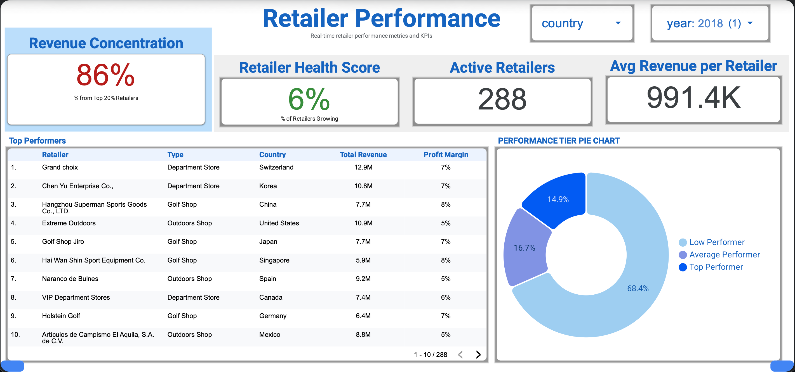

# 🏪 GoExplore Retailer Performance Dashboard

**WBS Coding School - Data Science & AI Bootcamp Group Project**

> My contribution: Retailer performance analysis and dashboard visualization

[](https://cloud.google.com/bigquery)
[](https://lookerstudio.google.com)
[]()

---

## 📋 Project Overview

**Company:** GoExplore (outdoor retail supplier)  
**Dataset:** Sales data from 2015-2018 across 21 countries  
**My Role:** Retailer performance dashboard creation  
**Tools:** Google Sheets → BigQuery → Looker Studio

---

## 🎯 Dashboard Metrics

I created a Looker Studio dashboard to track retailer partnership health and performance. Here are the key metrics I analyzed:

### 1. **Retailer Concentration (Top 20%)**
- **What it shows:** Percentage of revenue from top-performing retailers
- **Why it matters:** High concentration means dependency risk
- **My finding:** Identified concentration patterns by country

### 2. **Retailer Health Score**
- **What it shows:** Percentage of retailers with positive year-over-year growth
- **Why it matters:** Indicates overall partnership ecosystem health
- **Dashboard component:** Gauge chart showing health percentage

### 3. **Average Revenue per Retailer**
- **What it shows:** Mean revenue across all retail partners
- **Why it matters:** Baseline metric for partner performance evaluation
- **Dashboard component:** KPI scorecard

### 4. **Top 10 Retailers**
- **What it shows:** Highest-performing retail partners by revenue
- **Columns:** Retailer name, country, revenue, profit margin, growth rate
- **Dashboard component:** Sortable table with conditional formatting

### 5. **Performance Tiers**
- **Top Performers:** High growth (≥10%) + High margin (≥15%)
- **Average Performers:** Positive growth (≥0%)
- **Low Performers:** Negative growth (<0%)
- **Dashboard component:** Pie chart showing tier distribution

---

## 📊 Dashboard Components

### Visual Elements I Created:
- **KPI Cards:** Total retailers, avg revenue, health score
- **Pie Chart:** Performance tier breakdown (Top/Average/Low)
- **Table:** Top 10 retailers with sortable columns
- **Gauge:** Retailer health percentage
- **Filters:** Country, year range

### Interactive Features:
- Sort table by revenue, profit margin, or growth
- Toggle between different years to see trends

---

## 🛠️ Tools & Process

### 1. Data Exploration (Google Sheets)
- Reviewed sales data and retailer information
- Validated data quality
- Identified key metrics to track

### 2. Data Processing (BigQuery)
- Connected sales and retailer tables
- Calculated performance metrics (revenue, profit margin, growth)
- Created view for dashboard use

### 3. Dashboard Creation (Looker Studio)
- Connected BigQuery as data source
- Built visualizations for each metric
- Added filters for interactivity
- Applied conditional formatting

---

## 🎓 What I Learned

### Business Intelligence
- ✅ How to identify key performance indicators (KPIs)
- ✅ Importance of monitoring retailer concentration risk
- ✅ Creating actionable metrics for stakeholder decisions

### Technical Skills
- ✅ BigQuery: Writing SQL queries, creating views
- ✅ Looker Studio: Dashboard design, chart selection, filters
- ✅ Data Pipeline: Connecting Sheets → BigQuery → Looker Studio

### Dashboard Design
- ✅ Choosing the right chart types (pie, table, gauge, cards)
- ✅ Using conditional formatting to highlight important data
- ✅ Creating filters that make dashboards interactive

---

## 📸 Dashboard Preview

**Key Visualizations:**

1. **Performance Tier Distribution**
   - Pie chart showing Top/Average/Low performer split
   - Helps identify retailer development needs

2. **Top 10 Retailers Table**
   - Sortable columns: revenue, country, margin, growth
   - Conditional formatting: green (high growth), red (decline)

3. **Retailer Health Gauge**
   - Shows percentage of retailers growing year-over-year
   - Quick visual indicator of partnership ecosystem

4. **KPI Scorecards**
   - Total active retailers
   - Average revenue per retailer
   - Top 20% revenue concentration

**[View Live Dashboard](https://lookerstudio.google.com/reporting/c1096e68-96ab-42f1-8a48-9d77fbc4cf6e)**


*Screenshot of the retailer performance dashboard showing key metrics and performance tiers*]*

---

## 👥 Group Project Context

**Team Size:** 4 members  
**Duration:** 2 weeks  
**Course:** WBS Coding School - Data Science & AI Bootcamp

**My Contribution:**
- Retailer performance analysis
- Dashboard design and development
- KPI definition and metric selection

**Team Contributions:**
- Product category analysis
- Geographic market analysis  
- Financial overview dashboard

---

## 🗂️ Repository Contents

```
goexplore-retailer-analysis/
├── README.md                       # This file
├── sql/
│   └── retailer_analytics_view.sql # BigQuery view for dashboard
└── dashboard/
    └── retailer_dashboard.png      # Dashboard screenshot
```

---

## 📝 Reflection

**What I learned about the data pipeline:**

This project taught me how to navigate the complete data journey: Google Sheets → BigQuery → Looker Studio. The real challenge wasn't just learning each tool individually, but understanding how they work together to extract data that drives business decisions.

I applied the **data-to-ink ratio principle** I'd been learning about - stripping my dashboard down to what actually mattered: 4 scorecards, 1 table, 1 donut chart. Every element had to earn its place by answering: "Are our retailers growing? Are we too dependent on just a few partners?"

The retailer health score and performance tiers became the most valuable metrics because they're actionable - they directly inform which partners need support, which are strategic priorities, and where risks exist.

**What went well:**
- Successfully identified metrics that matter for partnership management
- Created a clean dashboard focused on clarity over aesthetics
- Learned to think from the stakeholder's perspective first
- Uniform design with color matching that's easy on the eyes

**What I'm still developing:**
- **Data visualization skills:** I want to apply more best practices like the data-to-ink ratio more consistently and improve my design choices
- **SQL proficiency:** BigQuery required refreshing my SQL foundations, and I need to master it further as it's the language underlying all these tools
- **Balancing clarity with presentation:** I'm not naturally creative, so I focus on data over aesthetics - but I'm learning to find that balance

**What I'd do differently next time:**
- Start with stakeholder interviews to understand their questions first
- Add more year-over-year comparison visuals
- Include drill-down capability for individual retailer deep-dives

**Looking ahead:**

This project showed me that **choosing the right metrics is more important than showing all available data** - a lesson I'll carry into my MLOps and AI automation work ahead.

---

## 🔗 Connect With Me

- 💼 [LinkedIn](https://www.linkedin.com/in/vennelchenfoo/)
- 🐙 [GitHub](https://github.com/vennelchenfoo)
- 📧 Email: 

---

**Built with:** Google Sheets • BigQuery • SQL • Looker Studio  
**Course:** WBS Coding School Data Science & AI Bootcamp  
**Date:** November 2025

---

<p align="center">
  <i>Learning to transform data into business insights</i>
</p>
